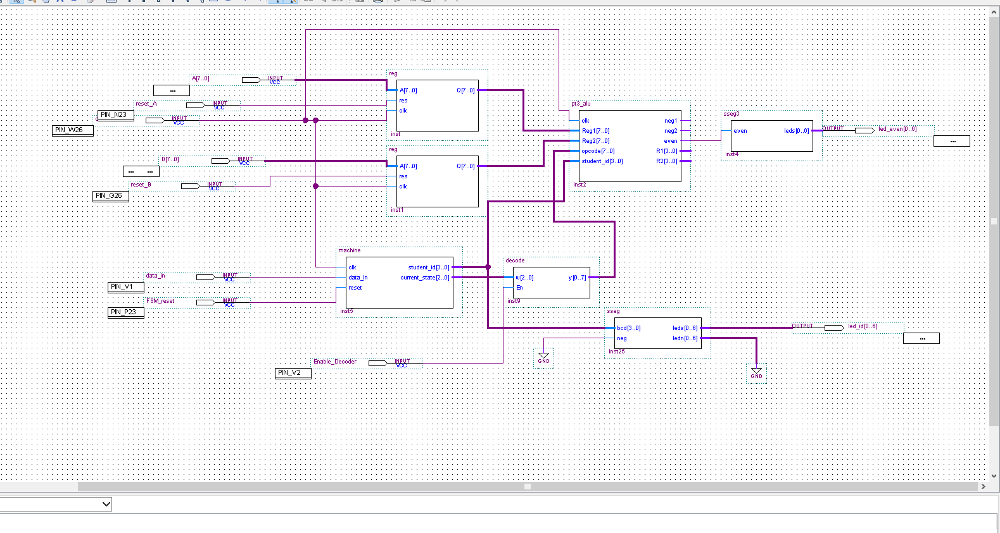

# Simple 8-bit CPU (VHDL – FPGA Project)

## Overview
This project implements a simple **8-bit CPU** using VHDL on an FPGA board.  
The design integrates **registers, a finite state machine (FSM), a decoder, and multiple ALU variants**.  
Outputs are verified with simulation waveforms and displayed on **7-segment displays**.

---

## Block Diagrams & Waveforms

### ALU_1
**Block Diagram**  

**Simulation Waveform**  

---

### ALU_2
**Block Diagram**  

**Simulation Waveform**  

---

### ALU_3
**Block Diagram**  

**Simulation Waveform**  

---

## Features
- **Registers** to store 8-bit inputs across clock cycles.  
- **FSM + Decoder** generate control signals and opcodes.  
- **ALU_1**: Standard arithmetic & logic operations (ADD, SUB, etc.).  
- **ALU_2**: Alternate operations with modified opcode mapping.  
- **ALU_3**: Even/odd check of input → outputs `"y"` or `"n"` on 7-seg.  
- **Output** displayed on dual 7-segment displays and a status display.  

---

## Tools
- **VHDL** for hardware description and logic design  
- **Quartus II** for simulation and synthesis  
- **FPGA board** for implementation and testing  
- **7-segment displays** for visual output  

---

## Results
- Verified CPU design through Quartus simulation waveforms.  
- Demonstrated functionality of multiple ALU variations.  
- Showcases understanding of sequential circuits, finite state machines, and processor design.  

---
